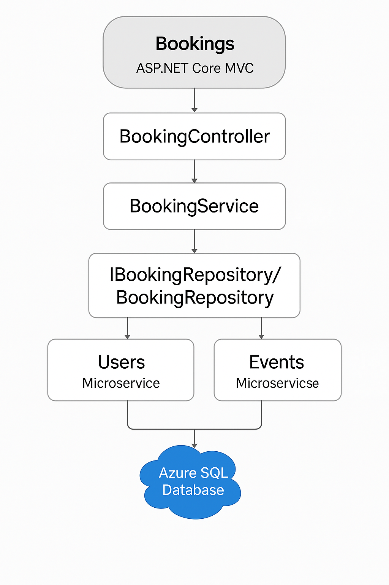
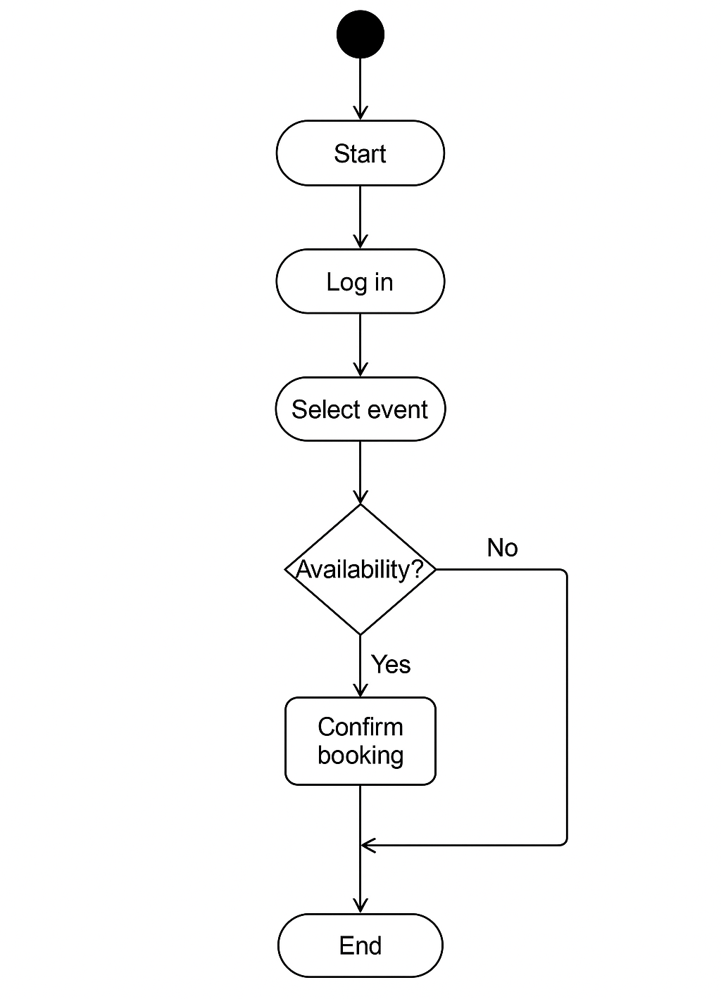
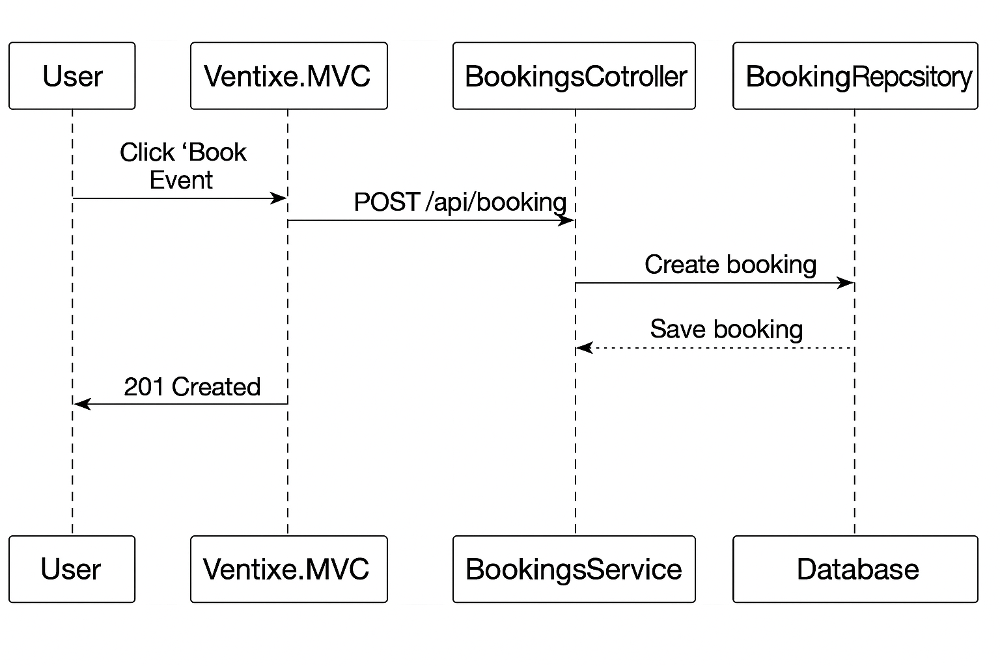


# 📦 Ventixe.Bookings.Grupp5.Api

A RESTful API for managing event bookings. Supports creating, filtering, updating, and retrieving booking-related data with JWT authentication and Swagger UI integration.

---

## 📊 Architecture & Documentation

The booking functionality is part of a larger microservices system. Below are diagrams to help you understand the process and structure:

### 🔧 System Architecture – Booking (MVC)


### 🧭 Activity Diagram – Booking Flow


### 🔁 Sequence Diagram – Booking Creation


> These diagrams are stored in the `/docs` folder and can be used in documentation, presentations, or as developer reference.

---

## 🚀 Getting Started

### ✅ Prerequisites

- [.NET 9 SDK](https://dotnet.microsoft.com/)
- SQL Server or Azure SQL
- Visual Studio 2022+ or Visual Studio Code

### 🔧 Setup

1. Clone the repository.
2. Update your connection string in `appsettings.json`:
```json
"ConnectionStrings": {
  "SqlConnection": "your-db-connection-string"
}
```
3. (Optional) Update the `Auth` section if using a custom JWT provider.

4. Run EF migrations:
```bash
dotnet ef database update
```

5. Start the project:
```bash
dotnet run --project Ventixe.Bookings.Grupp5.Api
```

6. Open your browser:
```
https://localhost:5001/swagger
```

---

## 🔐 Authentication

All endpoints require a valid JWT token via the `Authorization` header:

```
Authorization: Bearer <your_token>
```

---

## 📄 Swagger UI

Swagger documentation is available at:

```
https://localhost:5001/swagger
```

- All endpoints and models are listed
- DTO schemas included

---

## 🛠️ API Endpoints

### GET `/api/booking`
Fetch all or filtered bookings

**Query params:**
- `eventId`
- `statusId`
- `userId`

---

### GET `/api/booking/statistics`
Get aggregate statistics of all bookings.

---

### GET `/api/booking/{id}`
Get a booking by its ID.

---

### POST `/api/booking`
Create a new booking.

**Request body:**
```json
{
  "eventId": 1,
  "userId": "abc123",
  "statusId": 1
}
```

---

### PUT `/api/booking/{id}`
Update an existing booking.

**Request body:**
```json
{
  "eventId": 1,
  "userId": "abc123",
  "statusId": 2
}
```

---

## 📚 Technologies Used

- ASP.NET Core 9 Web API
- Entity Framework Core (Code-First)
- SQL Server
- Swagger (Swashbuckle)
- JWT Authentication

---